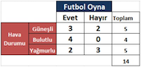
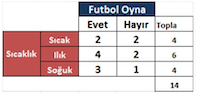

# Supervised Classification Decision Tree

Karar ağaçları – sınıflama, özellik ve hedefe göre karar düğümleri (decision nodes) ve yaprak düğümlerinden (leaf nodes) oluşan ağaç yapısı formunda bir model oluşturan bir sınıflandırma yöntemidir. Karar ağacı algoritması, veri setini küçük ve hatta daha küçük parçalara bölerek geliştirilir. Bir karar düğümü bir veya birden fazla dallanma içerebilir. İlk düğüme kök düğüm (root node) denir. Bir karar ağacı hem kategorik hem de sayısal verilerden oluşabilir.

Morgan ve Sonquist tarafından 1970 li yılların başlarında kullanılan AID (Automatic Detector) karar ağacı ilk algoritma ve yazılımdır.

  Karar ağaçları, eğitim verilerinin sınıflarını analiz eder ve test verilerinin hangi sınıfa ait olduğunu eğitim verilerinden çıkarttığı kurallara göre belirler.  (Erdem F., Derinpınar M.A.,  Nasirzadehdizajia., Bayram B. Şeker D., 2017)
Önceden tanımlanmış bir hedef değişkene sahiplerdir. Yapıları itibariyle en tepeden en aşağı inen bir strateji sunmaktadırlar (Kantardzic, 2011; Çelik U., Akçetin E., ve Gök M. , 2017).

Ağaç tabanlı öğrenme algoritmaları, en çok kullanılan gözetimli öğrenme algorimalarındandır. Sınıflandırma ve Regresyon problemlerinin ikisinde de kullanılabilir. Karar ağaçları random forest, gradient boosting gibi popüler ve güçlü yöntemlerde de kullanılmaktadır.

Bir karar ağacı, çok sayıda kayıt içeren bir veri kümesini, bir dizi karar kuralları uygulayarak daha küçük kümelere bölmek için kullanılan bir yapıdır. Yani basit karar verme adımları uygulanarak, büyük miktarlardaki kayıtları, çok küçük kayıt gruplarına bölerek kullanılan bir yapıdır. Karar ağaçlarının zayıf özelliği veriyi ezberlemesi (overfitting) denebilir. Bunun engellenmesi içinde ağaçların sınıflandırmadan önce veya sonra budanması gerekmektedir.

Aşağıda futbol oynayıp oynamamak için hava durumu özellikleri tablosu ve ilgili karar ağacı gösterilmektedir.

Örneğin yukarıda gösterilen karar ağacı, hava durumu kök düğümü ile başlamakta Güneşli, Bulutlu, Yüksek, Normal,Yok,Var diye dallanarak rüzgar ve ne gibi iç düğümlere veya evet, hayır gibi yaprak düğüme kadar ilerlemektedir.
Burada iç düğümler çoğalabilir bu tamamen durumun koşullarına bağlıdır ve sizin belirtebileceğimiz dallanma sayısı sınırı hiperparametresine bağlıdır.
Yani Güneşli havada Rüzgar iç düğümünden ve yok dalından sonra sıcaklık iç düğümü de eklenebilirdi; sıcak, ılık, soğuk dallanması ile Evet sınıfına veya Hayır sınıfına (yaprak düğümlere) ulaşabilirdik.

Dallanma öğrenme verisindeki feature sayısı ile orantılı olarak ve homojenliğin sağlanabilmesi ile ters orantılı olarak çoğalır.

Karar ağaçlarında amaç, veriyi belirlenmiş bir etikete göre gruplara ayırmaktı. Quinlan amca şöyle der:

Veri, bir özelliğe göre bölündüğünde elde edilen her bir veri kümesinin belirsizliği minimum ve dolayısıyla bilgi kazancı maksimum ise en iyi seçim yapılmış demektir. Bunun için özellik vektörleri incelenir ve en yüksek bilgi kazancına (Information Gain) sahip özellik, ağaçta dallanma yapmak için tercih edilir. Tabii bunun için birçok kombinasyonun çözülmesi gerekir.

Karar ağacı algoritmalarında bölünmenin nasıl gerçekleşeceği ağacın doğruluğunu etkileyen faktörlerdendir. Sınıflandırma ve regresyon problemleri için bölünme kriterleri genel itibariyle farklıdır.
Karar ağaçları, bir düğümü iki veya daha fazla alt düğümde bölmeye karar vermek için birden fazla algoritma kullanır. Alt düğümlerin oluşturulması, alt düğümlerin homojenliğini arttırır. Başka bir ifadeyle, düğümün saflığının hedef değişkenlere göre arttığını söyleyebiliriz.
Algoritma seçimi, hedef değişkenin tipine dayanır. 

En çok kullanılan karar ağacı algoritmaları:
- ID3 (Entropi + Bilgi Kazancı)
- C4.5  (ID3 algoritmasının uzantısı) 
- CHAID
- CART 

------

## Matematiksel İfade ve Basit Örnek:  

ID3 Algoritması

Futbol oynayıp oynamamak için hava durumu özellikleri tablosunu kullanarak  ID3 algoritması ile karar ağacını hesaplayarak oluşturalım.

ID3, Entropi ve Bilgi Kazancı üzerine oluşturulmuş bir algoritmadır.
**1-Entropi:** Belirsizliğin ve rastgeleliğin ortaya çıkma olasılığını hesaplar. Örneğin serideki tüm değerler birbirine eşitse entropi 1 olur, hepsi aynı ise de 0 olur.

###### Pi =olasılık,  c= değişken sayısı (burada 2 evet ve hayır)

E(FutbolOyna)=E(FutbolOyna=Evet)+E(FutbolOyna=Hayır)
 E(FutbolOyna) = p1 * log2p1 +  p2 * log2p2  

Evet için olasılık değeri p1 = 9/14=0.643
Hayır için olasılık değeri p2 = 5/14 = 0.357

E(FutbolOyna) =   0.643 * log2 (0.643) +  0.357 * log2 (0.357)  =  0.940

Entropi sadece hedef üzerine hesaplanmaz. Ayrıca özellikler üzerine entropi hesaplanabilir. Fakat özellikler üzerine entropi hesaplanırken hedefte göz önüne alır. Bu durumda entropi formülü:

###### P(c) =olasılık, E (c) = Entropi

E(FutbolOyna, HavaDurumu) = P(Güneşli)*E(3,2)+P(Bulutlu) * E(4,0)+P(Yağmurlu)*E(2,3)

P(Güneşli) = 5/14   = 0.3571    ,    E(3,2) = (3/5*  log2 (3/5)+2/5* log2 (2/5))   = 0.971
P(Bulutlu)= 4/14      = 0.286     ,     E(4,0) = (4/4*  log2 (4/4)+0/4* log2 (0/4))  = 0
P(Yağmurlu)= 5/14  = 0.357     ,    E(2,3) =  (2/5*  log2 (2/5)+3/5* log2 (3/5))  = 0.971

E(FutbolOyna, HavaDurumu) =  0.3571 * 0.971 + 0.286 * 0 + 0.357 * 0.971  =  0.694

Diğer özelliklerin de entropi değerleri aynı formüller uygulanarak hesaplanır.

E(FutbolOyna, Nem) = P(Yüksek)*E(3,4)+P(Normal)*E(6,1) = 0.788
       
E(FutbolOyna, Rüzgar) = P(Yok)*E(6,2)+P(Var)*E(3,3) =0.892
 
E(FutbolOyna, Sıcaklık) = P(Sıcak)* E(2,2) + P(Ilık)*E(4,2) + P(Soğuk)*E(3,1) = 0.911

**2-Bilgi Kazanımı:**

Bilgi kazanımı, bir veri setini bir özellik üzerinde böldükten (Örneğin E(FutbolOyna, HavaDurumu)) sonra tüm entropiden (E(FutbolOyna)) çıkarmaya dayanır. 

Entropinin değeri küçüldükçe  önemi  Decision Tree ID3  algoritması için artmaktadır. 1’e yaklaştıkça da önemi azalmaktadır. 
Ancak information gain’de olay tam tersidir ve bu açıdan entropinin tersi gibi düşünülebilir.  Decision Tree inşa edilirken en yüksek değerleri information gain’e sahip özellik seçilir.

Yukarıdaki bilgi kazancı formülü tüm featurelar için uygulandığında en yüksek değere bilgi kazancının en çok olduğu feature olarak tespit edilir.

Gain(FutbolOyna, HavaDurum) = E(FutbolOyna) – E(FutbolOyna, HavaDurumu) 
Yukarıdaki formülde E(FutbolOyna) ilk hesapladığımız hedef entropi idi  E(FutbolOyna, HavaDurumu) ise  feature entropisidir. 
Diğer feature lar da aynı formüle uygulanırsa aşağıdaki değerler elde edilir.

Gain(FutbolOyna, HavaDurumu) = 0.940 – 0.694 = 0.247

Gain(FutbolOyna, Nem) = 0.940 – 0.788 = 0.152

Gain(FutbolOyna, Sıcaklık) = 0.940 – 0.911 = 0.029

Gain(FutbolOyna, Rüzgar) = 0.940 – 0.892 = 0.048

Gain(FutbolOyna, HavaDurumu) özelliği en yüksek information gain değerine sahiptir. 
Yani Hava durumu kök düğüm olmaya hak kazandı ve hava durumunun özellikleri olan Güneşli, Bulutlu, Yağmurlu değerleride dal olmaya hak kazanarak ağacımızı oluşturmaya başladı.

Bu özellik seçildikten sonra özelliğin değerlerine bakılarak tekrar en yüksek information gain’e sahip feature seçilir. 
HavaDurumu Bulutlu olduğunda tüm FutbolOyna değerleri Evet’tir. 
Bulutlu değerleri ve karar ağacımız aşağıdaki gibidir:

**Hava Bulutlu** olunca 4 evet ile futbol oynanacak kararı çıktı peki güneşli veya yağmurlu ise ne olacak? Cevap: Teker Teker her bir dal seçilerek bilgi kazançları hesaplanaca.
İlk olarak hava durumu güneşli olan durumlar seçilir ve information gain hesaplanır.

**Güneşli durumu** için Futbol Oyna entropisi ile  Futbol Oyna; Sıcaklık,Nem, Rüzgar entropileri aşağıdaki şekilde hesaplanarak bilgi kazançları bulunur.

Gain(FutbolOyna, Sıcaklık)  = 0.971 – 0.9508 = 0.0202

Gain(FutbolOyna, Nem)      = 0.971 - 0.9508 = 0.0202

Gain(FutbolOyna, Rüzgar)  = 0.971 - 0 = 0.971

Hesaplama sonucunda bilgi Kazancı en yüksek feature olarak 0.971 ile Rüzgar iç düğüm olarak seçilmektedir. 
Rüzgar iç düğümünün dalları Var, Yok olarak atanır. 

Bu dal sonuçlarına göre de yine aynı şekilde bilgi kazancı hesaplanır. 

Burada Var ve Yok için aynı Bulutlu dalında olduğu gibi dalın hedef olasılığı Var için %100 Hayır, Yok için %100 Evet olduğundan dolayı Evet-Hayır yaprak düğümleri Güneşli iç düğümü tamamlanır.

Yağmurlu durumu içinde güneşli durumunda olduğu gibi entropi ve bilgi kazançları hesaplanır.

Gain(FutbolOyna, Nem)      = 0.971 - 0  = 0.971
Gain(FutbolOyna, Rüzgar)  = 0.971 - 0.8 = 0.171
 
Bilgi kazancı değerleri hesaplanır ve karar ağacı Nem iç düğümünde Normal ve Yüksek dallarına ulaşır bu dallarda homojenlik (tüm Nem Normal değerleri Evet, tüm Nem Yüksek değerler hayır) sağlandığı için yaprak düğümler ile karar ağacı oluşumu tamamlanır.

Eğer tamamlanmasaydı özyinelemeli bir şekilde homojenliği elde edene kadar yani iç düğüm kalmayıp tüm dallar yapraklara kavuşana kadar dallanma devam edecekti.

