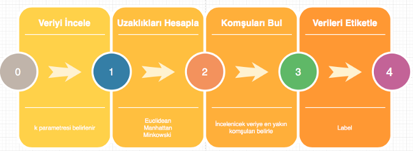
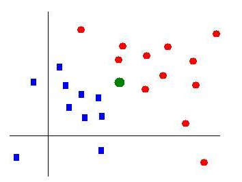
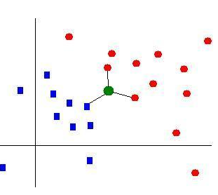
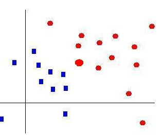
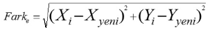
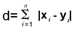
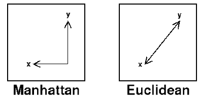
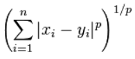
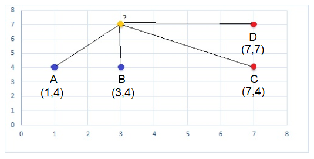

#Supervised Classification K-Nearest Neighbours

KNN algoritmaları, 1967 yılında T. M. Cover ve P. E. Hart tarafından önerilmiştir. En yakın komşuluk sınıflandırması sırasında çıkarılan özelliklerden (feature extraction) sınıfı tahmin edilecek olan örneğin sınıfı bilinen en yakın k tane örneğe bakılarak sınıflandırılmasıdır. 
En yakın örnekler 
- “Euclidean” Uzaklığı
- “Manhattan” Uzaklığı
- “Minkowski” Uzaklığı
hesabı ile tespit edilmektedir. 

Örneğin 2 boyutlu bir uzayda yeşil örneği yuvarlık kırmızı mı yoksa dikdörtgen mavi sınıfında mı olacağını belirleyelim. 
Bunu K=3 yani en yakın 3 komşuya bakarak yapılmasını istediğimizde aşağıdaki adımlar gerçeklenir.

Sırası ile ilk görselde sınıflandırılacak örnek uzaydaki konumunu alır, ikinci görselde en yakın 3 komşusunu bulur ve en çok olan komuşusu kimse örnekte o sınıfa atanır.

##Matematiksel İfade:

En yakın komuşuluk mesafe hesabında genellikle öklid mesafesi kullanılır.

**Öklid mesafesi**

formülü ile hesaplanır. Boyut arttıkca karekökün içine yeni parentezler (boyut sayısı kadar) girecektir.

**Manhattan mesafesi**

İki nokta arasındaki uzaklık, bu noktalardan geçen ve dik kesişen doğru parçalarının uzaklığı kadardır.   

Minkowski mesafesi 

 Öklid uzayı'nda bir metrik'tir iki Öklidyen mesafesi ve Manhattan mesafesi'nin bir genelleştirilmesi ile oluşturulur.

##Basit Örnek

|Feature1|Feature2|Sınıf|
|--------|--------|-----|
|1|4|Mavi|
|3|4|Mavi|
|7|4|Kırmızı|
|7|7|Kırmızı|

Tablomuz yukarıdaki gibi olsun ve tahmin edeceğimiz değer de (3,7) özniteliklerine sahip örneğin rengi olsun

1- K değeri 3 olsun.
2- Yeni eklenen değerin öklid mesafeleri hesaplanır.  Yeni nokta (3,7) koordinatlarında. 
Bu arada bu koordinatları her lokasyon olarak düşünmeyelim
örneğin 3000 maaş 5 yıl tecrübe 42 yaşındaki bir çalışanın en yakın komşularına bakarken (3000,5,42) uzaklıklarını ökid mesafesine göre hesaplarız. 

A(1,4) ve Yeni Nokta (3,7) ise
A ya olan öklid mesafesi  = √ ((3-1)²+(7-4)²)  =  √4+9 =  √13 = 3.606
B ye olan öklid mesafesi =  √ ((3-3)²+(7-4)²)  =  √0+9 = √9 = 3

|Örnekler| Yeni Örneğe Uzaklık | Sınıf|
|-------|---------------------|-------|
|A|3.606|Mavi|
|B|3|Mavi|
|C|5|Kırmızı|
|D|4|Kırmızı|

3- Uzaklıklar mesafelerine göre sıralanır ve ilk 3 örneğin sınıfına bakılır.  İlk 3 örnek B,A,D olarak sıralanır ve Mavi, Mavi, Kırmızı sınıfları alınmış olur. Bu şekilde sınıflardan ağır olan **Mavi** sınıfı yeni örneğin sınıfı olarak atanır ve işlem biter.
Burada en yakın 3 örneğe baktık peki en yakın 4 örneğe baksaydık 2 Mavi ve 2 Kırmızı olacaktı.  Bu durumda hangi rengi seçecekti onun cevabı da kullandığınız algoritmaya göre 
a- ilk sırada olanı
b- Rastgele
c- Son 2 farklı sınıftan mesafesi en yakın olanı
gibi farklı yöntemler uygulanmakta örneğin python scikit-learn kütüphanesinde KNeighborsClassifier kütüphanesininde aşağıdaki açıklama yapılmıştır: 
>"Regarding the Nearest Neighbors algorithms, if it is found that two neighbors, neighbor `k+1` and `k`, have identical distances but different labels, 
>the results will depend on the ordering of the training data."

Yani 1. sırada bahsettiğim gibi örneklerin sınıfları eşit ise ilk gelen sınıfa atama yapılmaktadır.

Bu sebeple K değerini genellikle tek sayı vermek algoritmayı bu seçimden kurtarıp tahmin doğruluğumuzu arttıracaktır.

---------

kNN için önemli konu eğitim kümesinin büyüklüğü ve seçilecek k değeridir. k değeri seçerken test yapılmalı ve başarısı yüksek olan k değerine ulaşılmalıdır. Bu da farkl veri setleri kullanılarak yaplacak testler ile belirlenir.  Bunun için python kısmında Gridsearch Validation gibi hiper parametre seçme algoritmalarını incelemek gerekmekte. kNN in kötü tarafı ise her bir eklemede uzaklıkların hesaplanmasıdır bu büyük verilerde yavaşlığa yol açabilir.

