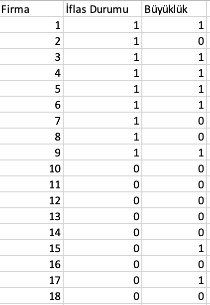

# Supervised Classification Logistic Regression

Regresyon analizi, herhangi bir değişkenin bir veya birden fazla değişkenle arasındaki ilişkinin matematik bir fonksiyon şeklinde yazılmasıdır.
Lojistik regresyon da bağımlı değişkenin dichotomus, bağımsız değişkenlerin ise kategorik veya sürekli olduğu bir çoklu regresyondur.

Lojistik regresyon da bir regresyon analizi olarak tanımlanabilse de lineer regresyondan teorik ve pratikte farklılıklar göstermektedir bu farklılıklar;

- Lineer regresyonda bağımlı değişken sürekli iken lojistik regresyonda kategoriktir.
 
- Sürekli bağımlı değişkene sahip olmadığı için hesaplamalarımızı lineer regresyonda olduğu gibi en küçük kareler yöntemi üzerinden yapamayız. Maksimum likelihood metodu kullanmamız gerekmektedir. Çünkü bağımlı değişkenin normal dağıldığını söyleyemeyiz.
 
- Lineer regresyonda teste başlamadan önce test edilmesi gereken önemli varsayımlar bulunmakta iken lojistik regresyonda çoklu doğrusal bağlantı (multicollinearity) ve aykırı değerler (outliers) dışında test etmemiz gereken varsayım bulunmamaktadır.

Lojistik regresyon evet/hayır gibi ikili kategorik bağımlı değişken üzerinde çalışmaktadır. Yani modelin temelini olasılık oluşturmaktadır.
 
Model, bir olayın gerçekleşme olasılığı ve gerçekleşmeme olasılığının birbirine bölünmesinin doğal logaritmasının alınması ile kurulmaktadır. Logaritmik dağılımın kullanılmasının nedeni dağılımı normalleştirebilmektir.
Kısacası kategorik değişken 1 ve 0 iken + sonsuz ile – sonsuz arasında değer alır.

## Matematiksel Gösterim:

Logit (p) = log [p/(1-p)] = ln [p/(1-p)]
Logit [p(x)] = log [p(x)/1-p(x)]=a+b1x1+b2x2+...+bixi

p = exp(a+b1x1+b2x2+...+bixi) / 1 + exp(a+b1x1+b2x2+...+bixi  )
p= Olasılık oranı

## Basit Örnek:

Basit örneğimiz için elimizde firmaların büyüklükleri ve iflas etme durumları ile ilgili bilgilerin olduğu bir feature larımız olsun.

|Finansal Durum|Büyük (1)|Küçük (0)| Toplam|
|--------------|---------|---------|-------|
|İflas Etmemiş|6|3|9|
|İflas Etmiş|2|7|9|
|Toplam|8|10|18|

Yukarıdaki tablolarda finansal durum ve büyüklük incelenerek tek kategorik değişkenli lojistik regresyon modeli açıklanmaktadır. Tabloda ki veriler ile aşağıdaki
olasılıklar hesaplanır.

MARJİNAL OLASILIKLAR
 
Herhangi bir firmanın iflas etmeme olasılığı=> P(FD=1)= 9/18=0,5
Herhangi bir firmanın iflas etme olasılığı=> P(FD=0)= 9/18=0,5
Herhangi bir firmanın büyük olma olasılığı=> P(BÜ=1)=8/18=0,44

KOŞULLU OLASILIKLAR
 
Büyük bir firmanın iflas etme olasılığı=> P(FD=0 / BÜ=1)=2/8=0,25
Küçük bir firmanın iflas etme olasılığı=> P(FD=1 / BÜ=0)=3/10=0,30

Olasılık değerlerini üstünlük oranı olarak da yazabiliriz; 
Herhangi bir firmanın iflas etmeme üstünlük oranı= ÜO(FD=1)= 9/9=1
Büyük bir firmanın iflas etmeme üstünlük oranı=ÜO(FD=1 / BÜ=1)=6/2=3
Küçük bir firmanın iflas etmeme üstünlük oranı=ÜO(FD=1 / BÜ=0)=3/7=0,43

Birbirlerine çevrilebileceğini söylemiş olduğumuz olasılıkları üstünlük oranları cinsinden şu şekilde ifade edebiliriz:

Büyük bir firmanın iflas etmeme olasılığı=P(FD=1 / BÜ=1)= ÜO(FD=1/BÜ=1)/1+ÜO(FD=1 / BÜ=1)=3/1+3=0,75

Büyük bir firmanın iflas etmeme üstünlük oranı=ÜO(FD=1 / BÜ=1)=
P(FD=1 / BÜ=1)/ 1-P(FD=1 / BÜ=1)=0,75/1-0,75=3
(Yukarıda verilen üstünlük oranı aslında bir durumun gerçekleşme olasılığının gerçekleşmeme olasılığına bölümüdür.)

Sonrasında elde ettiğimiz değerlerin doğal algoritmalarının alınması gerekmektedir.
 
ÜO(FD=1 / BÜ=1)=ln(3)=1,0986
ÜO(FD=1 / BÜ=0)=ln(0,43)=-0,844

Buradan hareketle lojistik regresyon formülümüzü şu şekilde kaleme alabiliriz:
(Finansal durumu iflas etmemiş olanlarda büyüklük etkisi)

 Ln[ÜO(FD=1 / BÜ)]=-0,844+1,0986 BÜ

Buradan hareketle büyük firmaların iflas etmeme üstünlük oranlarının küçük olanlara kıyasla daha yüksek olacağını söyleyebiliriz.

## Kaynaklar

https://www.academia.edu/11479607/Lojistik_Regresyon