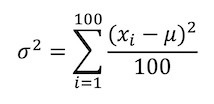
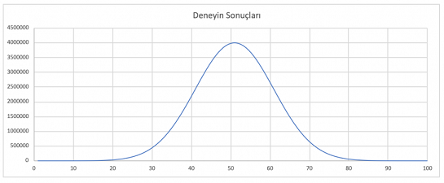

# Supervised Classification Naive Bayes

Matematikçi Thomas Bayes’den alan bir sınıflandırma/ kategorilendirme algoritmasıdır. Naïve Bayes sınıflandırması olasılık ilkelerine göre tanımlanmış bir dizi hesaplama ile, sisteme sunulan verilerin sınıfını yani kategorisini tespit etmeyi amaçlar.

Naïve Bayes sınıflandırmasında sisteme belirli bir oranda öğretilmiş veri sunulur (Örn: 100 adet). Öğretim için sunulan verilerin mutlaka bir sınıfı/kategorisi bulunmalıdır. Yani etiketlenmiş olmalıdır (denetimli öğrenme). Öğretilmiş veriler üzerinde yapılan olasılık işlemleri ile, sisteme sunulan yeni test verileri, daha önce elde edilmiş olasılık değerlerine göre işletvilir ve verilen test verisinin hangi kategoride olduğu tespit edilmeye çalışılır. Elbette öğretilmiş veri sayısı ne kadar çok ise, test verisinin gerçek kategorisini tespit etmek o kadar kesin olabilmektedir.

Naïve Bayes sınıflandırma yönteminin birçok kullanım alanı bulunabilir fakat, burada neyin sınıflandırıldığından çok nasıl sınıflandırıldığı önemli. Yani öğretilecek veriler binary veya text veriler olabilir, burada veri tipinden ve ne olduğundan ziyade, bu veriler arasında nasıl bir oransal ilişki kurduğumuz önem kazanıyor.

**Matematiksel İfade:**

Bayes Teoremi

Bu teorem bir rassal değişken için koşullu olasılıklar ile önsel (marjinal) olasılıklar arasındaki ilişkiyi gösterir.

###### P(A|B) : B olayı gerçekleştiği durumda A olayının meydana gelme olasılığı
###### P(B|A) ; A olayı gerçekleştiği durumda B olayının meydana gelme olasılığı
###### P(A) ve P(B) : A ve B olaylarının önsel olasılıklarıdır.

------

**Naive Bayes Sınıflandırma Modeli**

Bir sınıflandırma problemi bir çok özellikten ve bir sonuç (hedef) değişkeninden oluşur.

C verilen hedef ve F özelliklerimiz temsil eder. Naive bayes sınıflandırıcı basitçe bütün koşullu olasılıkların çarpımıdır.

------

**Basit Örnek**

| Meslek     | Maaş | Yaş | Tecrübe |
|------------|------|-----|---------|
| Mimar      | 3000 | 26  | 4       |
| Müzisyen   | 1500 | 22  | 2       |
| Mimar      | 5000 | 30  | 9       |
| Müzisyen   | 2000 | 30  | 7       |
| Müzisyen   | 500  | 18  | 3       |
| Mimar      | 2000 | 20  | 2       |
| Mimar      | 7000 | 29  | 5       |
| Müzisyen   | 6000 | 45  | 15      |

Yukarıdaki tablo eğitim verimiz olsun. 

Bu eğitim verisi ile naive bayes algoritması bize 3000 maaş, 30 yaş, 5 yıl tecrübe sahibi birinin mesleğini nasıl tahminlemektedir.

İlk önce veri setinde tahminini istediğimiz meslek feature 'nın (Mimar,Müzisyen) ortalama ve varyans değerleri hesaplanır.

>Ortalama = (n1+n2+n3+..nx)/x  değeridir. Yani bir serideki tüm sayıların toplanıp kaç adet sayı varsa ona bölümüdür.
>Varyans = Verilerin ortalamadan sapmasının karelerinin toplamının veri sayısına bölümüdür. 
>Standart Sapma = Verilerin ortalamadan sapmasının karelerinin toplamının karekök alınmış halidir.
>Kovaryans = iki değişken arasındaki doğrusal ilişkinin değişkenliğini ölçen bir kavramdır. Yani iki serinin dağılımının benzerliğini analiz ettiğimiz bir ölçüdür.

Örnek Mimar Maaş Varyans değeri hesabı = ( (3000-4250)2 +(5000-4250)2 +(2000-4250)2 + (7000-4250)2 ) / 4-1 =4916666,667

Örneklem Varyans Formülü 

-------

Burada varyans formülü aslında standart sapmanın karesidir yani varyansın karekökü standart sapmayı verecektir fakat bu tüm deney popülasyonunun varyansını bulmaya çalıştığımızda geçerli bir örneklemin varyansını alacağımız zaman "n" e değil "n-1" e bölünmesi gerekmektedir. Örneğin 100 satırlık ortalama maaş verimiz var. 
Bu verinin varyansı 

formülü ile hesaplanırken içinden 10 tane örneklemin varyansı 

ile hesaplanmaktadır. Bunun mantığı Bassel's Correction' a dayanır.

Yukarıdaki grafiği anlamaya çalışalım. Dediğimiz gibi 100 tane deney yaptık. Bunun grafiğini kolay anlaşılsın diye simetrik çizmeye çalıştım. Deney sayı olarak en az 0 ve en çok 4.000.000 çıkıyor. Ortalaması 999.999 oluyor. Standart sapmanın mantığını anlamak için bir doğruda bu deney sonuçlarını gösterip 10 tane örneklem alalım.

Birinci grafikte 100 tane nokta düşünün. Bunların hepsinden ortalama çıkartılıp(büyük turuncu nokta) kareleri alınıyor. İkinci grafikte ise 10 tane örnek alınıp(küçük kırmızı nokta) ortalaması alınıyor(büyük kırmızı nokta) ve aradaki mesafeler bulunuyor. İşte burada şunu görüyoruz. Popülasyonda bu mesafeler genişliyor(Okların mesafelerine bakabilirsiniz). Çünkü bizim popülasyonumuzda ortalamaya uzak değerler de var yani dağılma fazla. Yukarıdaki oklarda olduğu gibi 100 deney içinde bu mesafelerin karelerini alıp toplasak ve 100’e bölsek standart sapmayı buluyoruz. Fakat bunu örneklem için yaptığımızda mesafeler kısa olduğu için eğer örneğimizde olduğu gibi 10 tane örnek aldıysak ve 10’a bölersek popülasyonun standart sapmasından daha küçük bir standart sapma buluyoruz. 

Çözüm olarak bassel's düzeltmesi şunu diyor:

Bir popülasyonu tahmin etmek için kullanılan örneklem verisine estimator(tahmin edici) deniyor. Ve bunun beklenen değeri(Expected Value) popülasyonun verisine eşit olmak zorunda. Mesela yukarıdaki örnekte örneklemim ortalamasını buldunuz(büyük kırmızı nokta).Eğer siz bu 100 deneyden 10’ar 10’ar örneklemler alsanız ve her birinin ortalamalarını bulsanız. Bu ortalamaların ortalamasının popülasyonun ortalamasına eşit olması beklenir. (Turuncu büyük nokta) 

100 lük veriyi 10'ar 10'ar varyanslarını aldığınızda toplam veri ile aldığınız varyans toplamı birbirine eşit olmuyor bu eşitliği 10'ar lık varyans formülünü n/n-1 ile çarptığınızda eşitlik sağlanıyor.                  
Bu örneklem varyansındaki mantık da budur. Örneğin excel'de var.p ve var.s olarak iki fonksiyon vardır var.p populasyon var.s ile örneklem varyansını vermektedir.

-------

| Meslek   | Ortalama Maaş | Ort. Yaş | Ort. Tecrübe | Varyans Maaş | Varyans Yaş | Varyans Tecrübe |
|----------|---------------|----------|--------------|--------------|-------------|-----------------|
| Mimar    | 4250          | 26.25    | 5            | 4916666,667  | 20,25       | 8,666678        |
| Müzisyen | 2500          | 28.75    | 6.75         | 5833333,333  | 142,25      | 34,9166         |

Elde ettiğimiz tablo mesleklerin maaş yaş ve tecrübe özet bilgilerini vermekte peki naive bayes test verimizin hangi meslekten olacağına nasıl karar verecek? Naive bayes sınıflandırıcısı bütün koşulların olasılıklarının çarpımıdır.

bu formülde görüldüğü gibi s1 den sn'e kadar olan sınıflar arasından bir seçim yapılırken aslında bu sınıfın olasılık değeri ve bu sınıfları yerine getiren k koşulları için çarpımından bir farkı yoktur.

Yani aşağıdaki formüllerde görüldüğü gibi bir kişinin mimar olduğunu anlamak için önce mimarların oranını buluyoruz. "P(mimar)", ardından mimarlar için verilen maaş,yaş,tecrübeye göre koşullu olasılıklarını bulup bunu normalleştirme değerine bölüyoruz. Aynısını müzisyen içinde hesaplanır.

###### normalleştirme değeri aşağıdaki formül ile hesaplanır. Bu örnekte iki sınıf olduğu için normalleştirme değerini göz ardı edebiliriz.
###### normalleştirme = P(mimar) p(maaş | mimar) p (Yaş | mimar) p (iş tecrübesi | mimar) + {P(müzisyen) p(maaş | müzisyen) p (Yaş | müzisyen) p (iş tecrübesi | müzisyen)

öncelikle beklenti(mimar) değerini hesaplayalım.
p(mimar) = 4/8 = 0.5
p(maaş|mimar) = Burada koşullu olasılık hesaplamak için dağılımları hesaplanmalıdır. Birkaç dağılım hesaplama yöntemi vardır. Burada normal (gauss) dağılımı kullanılacaktır. Diğer dağılımlar: Ki-Kare, t-dağılımı, F dağılımıdır.

 gauss dağılım formülü kullanılarak;

 değeri hesaplanır.

###### σ² değeri 4.91E6² olarak daha önce hesaplanan mimar varyans maaş değeridir.
###### x değeri 3000 olarak bizim tahminlenmesini istediğimizi maaş değeridir.
###### µ değeri daha önce hesaplanan ortalama mimar maaşıdır.)

maaş mimar koşullu olasılığında 3000 lira maaşın mimar olma olasılığı  0.0000000687 olduğunu bulduk. başka bir deyişle bu kişi mimar ise (verilen koşul bu olsun) maaşının 3000 lira olma durumunu hesapladık.

şimdi bu maaş değeri için muzisyen mesleğinde olma olasılığını hesaplayalım.

(3000 maaş ile müzisyen (8.11E-8) olasılığı mimar (6.84E-8) olasılığına göre daha fazla olduğu görülmektedir.)

Diğer koşullu olasılıkları da aynı şekilde hesaplarsak aşağıdaki tabloyu elde ederiz.

| Meslek   | Maaş       | Yaş          | Tecrübe     |
|----------|------------|--------------|-------------|
| Mimar    | 6.84074E-8 | 0.002805118  | 0.011414151 |
| Müzisyen | 8.11614E-8 | 0.0019705849 | 0.046043474 |

Bu hesaplamaar sonucunda yazının başında belirtilen beklenti(mimar) ve bekleni(muzisyen) değerleri hesaplanır.

beklenti olasılıklarına bakarak  3000 maaş, 30 yaş, 5 yıl tecrübe sahibi bir kişinin mimar - müzisyen meslekleri arasından müzisyen 20 kat daha kuvvetli olasılıktadır. 

Yani naive bayes sınıflandırma modeli bu kişiyi müzisyen sınıfına atamaktadır.

##Python

##Kaynaklar
http://bilgisayarkavramlari.sadievrenseker.com/2013/02/08/naif-bayes-siniflandiricisi-naive-bayes/
https://acemiadam.com/orneklemin-standart-sapmasinin-hesaplanmasi

