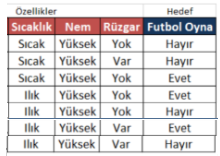

# Supervised Classification Random Forest

Rastgele Orman,yöntemi temelinde karar ağaçları olan esnek bir yapıya sahip makine öğrenmesi algoritmasıdır. 
isminin orman kısmı birçok karar ağacının kullanılması ve tüm ağaçların oylarının sayılarak demokratik bir şekilde ağırlığı yüksek olan oy'a (sınıfa) atamanın yapılmasıdır.
İsminin rastgele kısmı ise karar ağaçlarında bahsettiğimiz kök düğümü (Root Node) bulma ve düğümleri bölme işlemlerinin rastgele çalışıyor olmasıdır. 

Rastegele orman yönteminin bu özellikleri sayesinde karar ağaçlarında belirttiğimiz aşırı ezberleme (overfitting) durumunun ortaya çıkma ihtimalini azaltmış oluyoruz.

Rastgele Orman algoritmasında iki aşama bulunmaktadır, birisi Rastgele Orman oluşturulmasıdır, diğeri ise ilk aşamada oluşturulan Rastgele Orman sınıflandırıcısı (classifier) üzerinden tahmin yapmaktır.
Aşağıda örnek bir orman sınıflandırması şekille gösterilmiştir.

## Matematiksel İfade :

Rastgele orman modeli karar ağaçlarını kullanarak oluştuğundan Desicion Tree algoritmasının matematiksel formülü ile neredeyse aynı formüldedir.  İşlem sıralanışı şu şekildedir:

1- Toplam “M” özelliklerden rastgele olarak “K” özelliklerini seçin. (K<M olmalı) 
Random özellik seçimi.
2- “K” özellikleri arasından en iyi ayırma noktasını kullanarak  kök düğümünü hesaplayın. 
Entropi ve Bilgi Kazancı: 

ve Gain (T,X) = Entropi(T) - Entropi(T,X)

3- En iyi ayırmayı kullanarak düğümü dallara iç düğüm ve yaprak düğümlere ayırın.
Tekrar Entropi ve Bilgi Kazancı ile
4- Hiperparametre olarak belirtilen düğüm sayısına ulaşılana kadar 1. ve 3. Adımları tekrarlayın.
5-  Hiperparametre olarak belirtilen  sayıda ağaç oluşturmak için belirtilen sayı kadar 1. ve 4. Adımları tekrarlayın.

## Basit Örnek:

Aşağıdaki tablodan öğrenilen hava durumu verilerine göre hava durumuna göre futbol oynanıp oynanmayacağını 2 ağaçlı rastgele orman yöntemi ile tahminleyelim.

**1-** İlk olarak 4 feature içerisinden Rastgele 3 adet feature (özellik) seçelim. Burada 3 model için bir hiperparametredir; 4,2,1 olarak ta rastgele özellik saçimi yapabiliriz bunu modele biz belirtebiliriz.

Burada durum rastgele Hava Durumu, Nem ve Rüzgarın seçildiğini varsayalım artık karar ağacı oluşturacağımız yeni tablomuz aşağıdaki gibidir.

**2-** Bu tabloya göre karar ağacımızı oluşturalım. Öncelikle Hedef ve Özelliklerin Entropilerini hesaplayalım.

Toplam 14 tane hedef değeri 2 sınıfa ayrılmakta bunlardan 9 Evet, 5 Hayır bulunmakta ise entropi aşağıdaki gibi hesaplanır.

E(FutbolOyna) =   9/14 * log2(9/14) + 5/14 * log2 (5/14)
E(FutbolOyna) =   0.643 * log2 (0.643) +  0.357 * log2 (0.357)  =  0.940   

E(FutbolOyna, HavaDurumu) = P(Güneşli)*E(3,2)+P(Bulutlu) * E(4,0)+P(Yağmurlu)*E(2,3)   =  0.694  
E(FutbolOyna, Nem) = P(Yüksek)*E(3,4)+P(Normal) * E(6,1)  =0.788   
E(FutbolOyna, Rüzgar) = P(Yok)*E(6,2)+P(Var) * E(3,3) =0.892 

Daha sonra bunlar arasında bilgi kazancı en yüksek olanı seçelim

Gain(FutbolOyna, HavaDurumu) = 0.940 – 0.694 = 0.247
Gain(FutbolOyna, Nem) = 0.940 – 0.788 = 0.152
Gain(FutbolOyna, Rüzgar) = 0.940 – 0.892 = 0.048

Hava Durumu Bilgi kazancı en yüksek feature olarak kök düğüm onun Yağmurlu, Bulutlu ve Güneşli değerleri de dal olarak seçilir.  

**3-** Daha sonra Güneşli, Bulutlu ve Yağmurlu dalları iç düğüm veya yaprak düğümlere ayrılmak üzere aynı şekilde entropi ve bilgi kazançları hesaplanır. 

**Güneşli hava durumu için;** 

Gain(FutbolOyna, Nem)     = 0.971 - 0.9508 = 0.0202
Gain(FutbolOyna, Rüzgar)  = 0.971 - 0  = 0.971
 
**Bulutlu için;**

E(Bulutlu) = 0 çıktığından yaprak düğüme ulaşılır ve dallanma Evet olarak biter.

**Yağmurlu için;**

Gain(FutbolOyna, Nem)     = 0.971 - 0    = 0.971
Gain(FutbolOyna, Rüzgar)  = 0.971 - 0.8  = 0.171

**4-** Bilgi kazancı değerleri hesaplanır ve aşağıda gösterilen karar ağacı oluşur. Bu cepte dursun.

**5-** Yapılan bu işlemler 1. adımdan 4. adıma kadar aynı şekilde tekrarlanır fakat bu adımda tek bir fark olabilir o da 1. adımda rastgele seçilen 3 feature'ın aynı featurelar gelmeme durumudur. Mesela bu seferki 3 feature da Sıcaklık, Nem, Rüzgar olsun (ilk ağacın kök düğümü elenmiş olsun, tabi bu tamamen rastgeledir. )

Aynı işlemler tekrar uygulandığında;

Gain(Nem) = 0.940 -0.788 = 0.152
Gain(Rüzgar) = 0.940 - 0.892 = 0.048
Gain(Sıcaklık) = 0.940 - 0.911  = 0.029

sonuçlarına göre Nem Kök düğümü ile ağaca başlarız.

Nem Normal ve Yüksek olarak dallara ayrılır. Bu dallarında kendi iç düğümleri için bilgi kazançları hesaplanır.

E(FutbolOyna) = 0.985

E(FutbolOyna) = 0.589

Yüksek Dalının iç düğümleri için bilgi kazancı hesabı:

Gain(Sıcaklık) = 0.985 - 0.964 = 0.021
Gain(Rüzgar) = 0.985 - 0.964 = 0.021

Eğer bilgi kazançları bu örnekteki gibi eşit çıktıysa birkaç alternatif var. Bunlardan en çok kullanılanı çok basit feature A-Z sıralamasına göre önde olanı seçmek. Diğer uygulamalar ise Akaike's Information Criterion gibi farklı kriterlerle karşılaştırmak.
Biz alfabeye göre sıralarsak Rüzgar iç düğümümüz olacaktır.

Normal Dalının iç düğümleri için bilgi kazancı hesabı:

E(FutbolOyna,Sıcaklık) = P(sıcak) * E(1,0) + P(ılık) * E(2,0) + P(soğuk) * E(3,1)
                       = 1/7 * 0 + 2/7 * 0 + 4/7 * ( 3/4 * log2(3/4) + 1/4 * log2(1/4) ) = 0.811

E(FutbolOyna,Rüzgar) = p(yok) * E(5,0) + P(var) * E(1,1)
                     = 5/7 * 0 + 2/7 * 1 = 0,285

Gain(Sıcaklık) = 0.985 - 0.811 = 0.174
Gain(Rüzgar) = 0.985 - 0.285  = 0.700

Bilgi kazancı en yüksek olan Rüzgar bu dalda da iç düğüm olmayı başarmaktadır. Ve ağacımız aşağıdaki gibi dallanmaya başlamakta.

Burada sırada Normal ve Yüksek dallarının Rüzgar iç düğümlerinin entropilerine ve gerekirse bilgi kazançlarına bakma sırası geldi.

- Nem Normal iken Rüzgar yok dalı için entropi  (E(futbolOyna)) = 5/5 * log2(5/5) + 0/5 * log2(0/5) ) = 0 olduğundan Evet ile homojenliğe ulaşmakta.
- Nem Normal iken Rüzgar var dalı için entropi  (E(futbolOyna)) = 1/2 * log2(1/2) + 1/2 * log2(1/2) ) =  1 olduğundan ve sıcaklık iç düğümü de 1 entropiye sahip olduğundan homojenliği yakalayamayacaktır.

- Nem Yüksek iken Rüzgar yok dalı 1 entropi değerine sahip ve sıcaklık iç düğümünün sıcak ve ılık dalları da 1 entropi ye sahip  olduğundan homojenliği yakalayamayacaktır.
- Nem Yüksek iken Rüzgar var dalı Sıcaklık iç düğümüne bakarak Sıcak ve ılık dallarının entropilerini hesaplar sıcak dalı entropisi 0 olarak hesaplanır ve Hayır sınıfına atanır yani Hayır yaprak düğümü ile dal biter. Ilık dalı entropisi ise 1 olarak hesaplanır ve   homojenliği yakalayamaz.

Bu anlatım sonrasıda karar ağacımız kimi dallarında yaprak düğümlere ulaşıp kimi dallarında ulaşamayarak aşağıdaki şekli alır.

**6-** Bu tamamlanan karar ağacı da rastgele ormanın 2. ağacıdır. Yani 2 ağaçlı rastgele orman algoritmamız aşağıdaki gibi oluştu.

Şimdi eğitim veriseti ile modelini olşturduğumuz rastgele orman algoritmamıza test veri setimiz ile sorular sorup doğruluğunu ölçebilir ve o doğruluk ölçüsünde yeni soruların cevaplarını bulabiliriz. Örneğin Yağmurlu bir havada normal nem varsa ve rüzgar yoksa futbol oynanır mı? sorusunu ormanımız 2 karar ağacınında evet oyuyla Evet oynanır cevabını verecektir.

