# Supervised Classification Support Vector Machine

1963 yılında Vladimir Vapnik ve Alexey Chervonenkis tarafından temelleri atılan “Destek Vektör Makineleri (DVM)” istatiksel öğrenme teorisine dayalı bir gözetimli öğrenme algoritmasıdır. Her ne kadar temelleri 60'lı yıllara dayansada 1995 yılında Vladir Vapnik, Berhard Boser ve Isabelle Guyon tarafından geliştirilmiştir (Akpınar, H., 2017).

Destek Vektör Makineleri, temel olarak farklı sınıflara ait verileri birbirinden en uygun şekilde ayırmak için kullanılır. Bunun için karar sınırları yada diğer bir ifadeyle hiper düzlemler belirlenir. Biraz daha detaylı tanımlamak gerekirse veriyi liner olarak ayırabileceği uzaylara ayırarak verileri düzlemsel olarak birbirinden ayırmayı hedeflemektedir, burada 2 temel işlem yapar ilki veriyi düzlemsel ayırabileceği uzaylara ayırmak ikinciside her bir uzayda düzlemsel olarak sınırları ayırmak. Eğer verimiz zaten lineer dağılmış ise ilk işleme gerek kalmadan doğrudan veri bir düzlem ile ayrılır, buna karşın verimiz non-lineer dağılmışsa önce uzaylara ayırıp sonra düzlemlere ayırır bu düzlemlere de hiperdüzlem denilmektedir.

Avantaj ve Dezavantajları

- Doğrusal ve doğrusal olmayan veriler için kullanışlı bir model
- Çok boyutlu veriler için etkili bir modeldir.
- Boyut sayısı örnek sayısından fazla olduğu durumlarda da etkili bir model olarak kullanılır.
- Eğitim verilerini parçalara ayırdığı için bellek kullanımında çok yük getirmemektedir.
- Çok yönlü: Karar fonksiyonu için çok farklı çekirdek fonksiyonları (“kernel functions”) kullanılabilmektedir.
- Doğru çekirdeği ve parametrelerini seçmek yoğun bir hesap gerektirmekte.
- Veri setinde gürültü outlier varsa model etkisiz kalır ve hatalı, aynı sonuçları üretir.
- Model olasılık tahminini kendisi veremiyor farklı k-fold cross validation ile tahminler oluşturulabilir.

Destek Vektör Makineleri, veri setinin doğrusal olarak ayrılabilme ve ayrılamama durumuna göre ikiye ayrılmaktadır.

## 1- Doğrusal Destek Vektör Makineleri

 Destek vektör makineleriyle sınıflandırmada, iki sınıfa ait örneklerin doğrusal olarak dağıldığını varsayalım. Bu durumda bu iki sınıfın, eğitim verisi kullanılarak elde edilen bir karar fonksiyonu yardımıyla birbirinden ayrılması amaçlanır.  

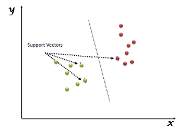

Karar doğrusunun yeni katılacak olan veriye karşı dayanıklı olabilmesi için sınır çizgisinin, iki sınıfın sınır çizgisilerine en yakın uzaklıkta olması gerekmektedir. Bu sınır çizgisine en yakın noktalar, destek noktaları olarak adlandırılmaktadır.
Aslında destek vektör mantığı da buradan gelmekte, Örneğin aşağıda verilen şekilde sol tarafta kırmızı ve yeşil sınıfları %100 doğrulukla ayıran bir çizgi mevcut sağ tarafta ise aynı verileri yine %100 doğrulukla ayıran başka bir çizgi mevcut ikiside eğitim verisini tam performans ayırmakta fakat benim modelimin çizgisi hangisi olmalı sorusuna bir cevaba ihtiyacım var. 

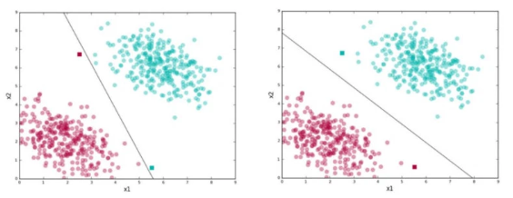

Burada modeller eğitim verileri açısından doğru görünsede test verileri ile test edilirken hatara oranının en aza inmesi için iki sınıfı birbirinden en uzak tutacak ayrıma ihtiyaç var. İşte o ayrım destek vektörleri ile yapılmakta, Aşağıdaki şekilde gösterildiği gibi eğitim veri sınıflarından ortadaki çizgiye en yakın olan noktalardan geçen iki çizgi hesaplanır bunlar destek vektörleridir. Bu çizgilerin arasında kalan çizgi ise hiperdüzlemdir. Ve sınıflandırma bu hiperdüzlem formülüne göre yapılmaktadır.

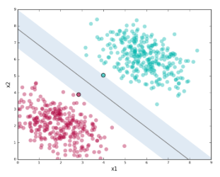

Yukarıda 2 boyutlu verilerin sınıflara ayrılması gösterilirken boyut sayısının artabileceği de unutulmamalıdır. Boyut arttıkça yine üstteki şekile benzer bir çalışma mantığı ile n sayıda düzlemde ayrım yapan çizgiler birleşimi hiperdüzlemi oluşturur.

(Hiperdüzlem : Hiper düzlem, geometride bir kavramdır. Düzlemin farklı boyutlarda bir genellemesidir. Bir n boyutlu alanın bir hiper düzlemi, boyut ile düz bir alt kümedir. Doğası gereği, alanı iki yarım alana ayırır.)

Hata İznini Ayarlama:
Gerçek yaşamda sınıflar birbiri ile daha heterojen karışmış olabiliyorlar bunun için modelin çalışma prensibi olan destek vektörlerinin arasının fazla olması gerekliliği gerçek hayat problemlerinde fazla hataya izin vermektedir.  Destek vektörlerinin bu açıklığını modelde C parametresi ile tanımlarız C parametresinin 2  isteği vardır. 

1. Geniş marjin
2. Eğitim Verilerinin Doğru Sınıflandırılması

Örneğin; aşağıdaki gibi iki sınıfı SVM ile sınıflandıracağımız zaman C parametresinin etkisinin ne olduğunu gözlemleyebiliriz. SVM de en önemli konulardan biri doğru C değerini belirleyebilmektir bunun içinde çapraz doğrulama (Cross Validation) veya Grid Search tekniği kullanılabilmektedir. Bu tekniklerin ne olduğuna da ilerde geleceğiz. Ama basitçe Cross Validation verimiz ile modeli geliştirmemiz için verinin bir bölümü ile (örneğin %70 i ) model oluşturup kalan bölümü ile test eder bu işlemi k fold cross validation yöntemi ile yaparsak k defa farklı train/test verisi ile yapar ve model performansını artırmasını sağlayan ve ezberleme yapmasını önleyen modelin bulunmasını sağlar. GridSearch ise hiper parametre optimizasyonudur ( C SVM için bir hiperparametredir mesela) Modeli ve verilerinizi sabit tutarak hiperparametreleri değiştirip model hata miktarını hesaplar bu sayede en iyi hiperparametre kombinasyonunu bulmayı amaçlar. Günün sonunda hiperparametre değerlerini doğrudan söyleyebilmektedir. Bunlar veriler doğrusal olarak birbirinden ayrılabildiği yani çok iyi bir dağılımda olduğu zaman geçerliydi fakat ya veri bu kadar iyi dağılım göstermiyorsa?

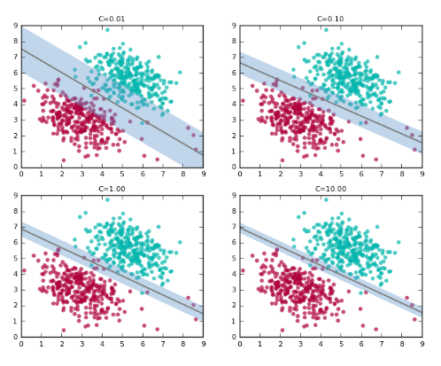

## Matematiksel Gösterim:

Hiperdüzlem H için
w•xi +b ≥ +1 , yi =+1 iken  
w•xi +b ≤ -1 ,  yi = –1 iken
H1 ve H2 düzlemleri: H1: w•xi +b = +1 ;  H2: w•xi +b = –1 
Noktaladan geçen H1 ve H2 Destek vektörleri H0 ise bu düzlemlerin medyanıdır, yani H0: w•xi +b =0
d- = negatif en yakın noktaya en kısa mesafe
d+= pozitif en kısa noktaya en yakın mesafe

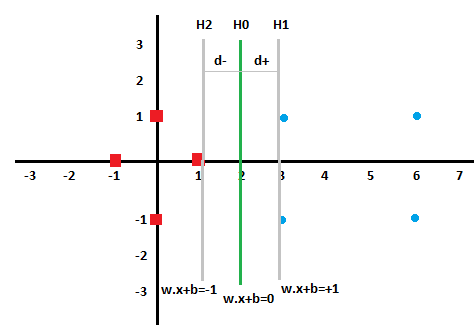

## Basit Örnek:

Örnek olarak 
pozitif olarak etiketli noktalarımız:   (3 1), (3 −1), (6 1) , (6 −1)
negatif etiketli noktalarımız ise:       (1 0),  (0 1), (0 −1) , (−1 0) 
olsun.

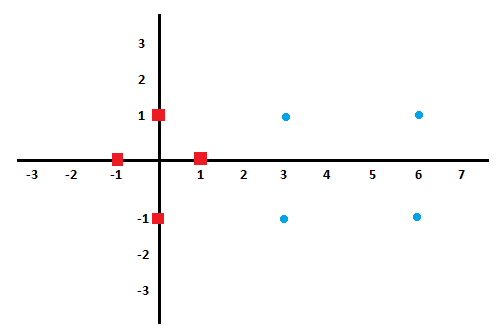

Destek vektörleri iki farklı sınıfta birbirine en yakın olan noktalar olacaktır. Bunlar s1=(1 0), s2=(3 1), s3=(3 -1)

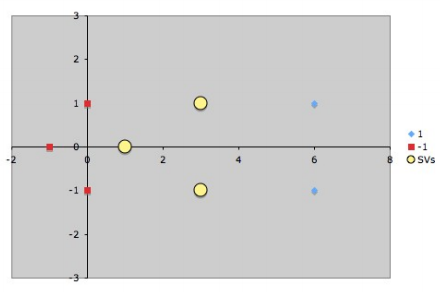

iki sınıfı ayıracak SVM düzeyi bulmayı hedeflemekteyiz veri lineer olarak ayrılabilen bir veri olduğu için lineer SVM fonksiyonu Φ()      tespit etmeyi amaçlıyoruz.
Destek vektörleri 1 bias girdisi ile arttırılmış olarak vektörize edeceğiz.
 s1 = (1,0)  ise s˜1 = (1,0,1);    s˜2= (3,1,1);     s˜3= (3,-1,1)

Aşağıdaki şekilde verdiğimiz SVM mimarisinde a1,a2 ve a3 değerlerini bulmak için vektörize ettiğimiz destek noktalarını negatif ve pozitif sınıflar için denklemlerini kurarız.

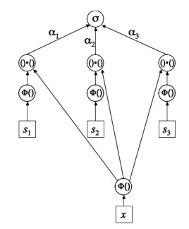

α1Φ(s1) · Φ(s1) + α2Φ(s2) · Φ(s1) + α3Φ(s3) · Φ(s1) = −1 
α1Φ(s1) · Φ(s2) + α2Φ(s2) · Φ(s2) + α3Φ(s3) · Φ(s2) = +1 
α1Φ(s1) · Φ(s3) + α2Φ(s2) · Φ(s3) + α3Φ(s3) · Φ(s3) = +1

α1s˜1 · s˜1 + α2s˜2 · s˜1 + α3s˜3 · s˜1 = −1
α1s˜1 · s˜2 + α2s˜2 · s˜2 + α3s˜3 · s˜2 = +1 
α1s˜1 · s˜3 + α2s˜2 · s˜3 + α3s˜3 · s˜3 = +1

vektörlerin çarpımı sonrasında;

>Örn. Vektör çarpımı
>(a,b,c).(d,e,f) = a * d+b * e+c * f yani s˜1 · s˜2
>(1,0,1).(3,1,1) = 1 * 3+0 * 1+1 * 1=4

2α1 + 4α2 + 4α3 = −1
4α1 + 11α2 + 9α3 = +1
4α1 + 9α2 + 11α3 = +1

burada yukarıdaki denklemleri taraf tarafa topladığımızda: a1= -3.5,  a2= 0.75,  a3 = 0.75 olarak hesaplanır.

Şimdi bu ai değerlerin ayırıcı hiperdüzlemi nasıl etkilediğine bakalım.

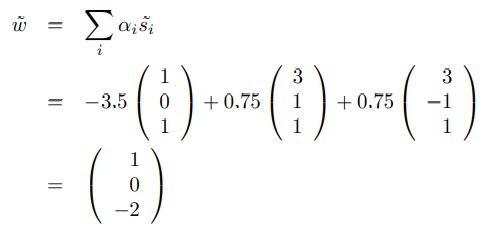

daha önceden bias eklediğimiz vektörü çıkararak w ve offset b değerlerine ayırırsak hiper düzlem formülümüz
y = wx+b  w = (1 0)  ve b = −2  olur.

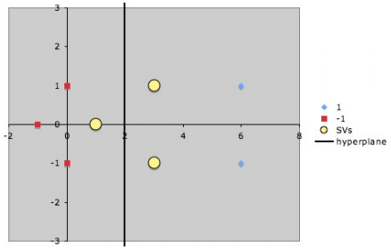

## 2-Doğrusal Olmayan Destek Vektör Makineleri

Bu durumda, verileri iki sınıf arasında net bir bölme marjına sahip olan başka bir boyuta dönüştürmeye yardımcı olan çekirdek (kernel) işlevlerini kullanırız. Çekirdek, doğrusal olmayan uzayı doğrusal uzaylara dönüştürülmesine yardımcı olur.
Burada çekirdek modeli önem arz etmekte çünkü doğru çekirdek modeli ile doğrusal olmayan verileri doğrusal parçalara bölüp 1. bölümde gördüğümüz doğrusal hiper düzlemlere ayırarak verimizi kolayca sınıflandırabiliriz.

Çekirdek modelleri verinin dağılımına göre birçok model kullanılabilir bu modelleri kendimiz de seçebilir veya yazabiliriz fakat zaten sıklıkla kullanılan ve güvenilir sonuçlar veren;
- Doğrusal (lineer)
- Radyal Bazlı Fonksiyon (Radial Basis Function -RBF-)
- Polinominal (Polynomial)
- Sigmoit (Sigmoid)

Fonksiyonları sıklıkla kullanılmaktadır.
Hazır kütüphanelerde veya kendiniz yazacağınız zaman SVM modeline belirtmeniz gereken veya (K-fold ,Grid Search Validation) gibi yöntemler ile test ederek bulmamız gereken en önemli hiperparametre *Kernel yani çekirdek* parametresidir. Çekirdek parametresi yanında *Gamma* parametresini de (RBF, poly, sigmoid çekirdek fonksiyonları için katsayı değeri ) hiper parametre olarak belirtmek ve test etmek gerekmektedir. Bu fonksiyonların hangisinin verinizi daha iyi ayırdığının testi model için en önemli ayardır (Model Tuning). 
Daha sonra 1. bölümde Doğrusal DVM'de de gördüğümüz *C hata değeri* hiperparametresi var bu parametre ile de hiperdüzlemi daha doğru konumlandırma testini yaparak bir değer belirlenir. Bu Tuning işlemini ileride tüm modelleri kapsayacak şekilde daha detaylı aktaracağım.

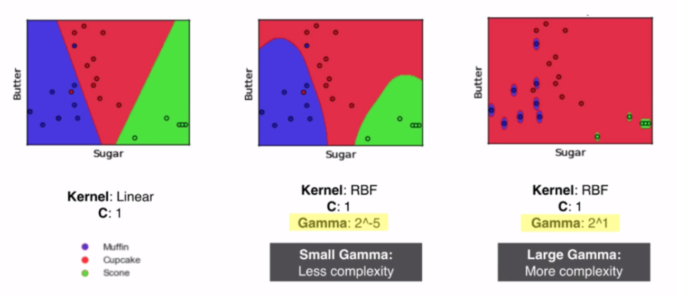

Doğrusal olmayan destek vektör makineleri de çekirdek tarafından doğrusal yapıya ulaştırıldığında 1. bölümde gösterilen hiper düzlemin matematik altyapısını kullanarak sınıflandırır. 

Matematiksel Gösterim:

Basit Örnek:

(2 2), (2 −2), ( −2 −2), ( −2  2) pozitif etiketli
(1 1), (1 −1), (−1 −1),  (−1  1) negatif etiketli
doğrusal olmayan verilerimiz olsun.

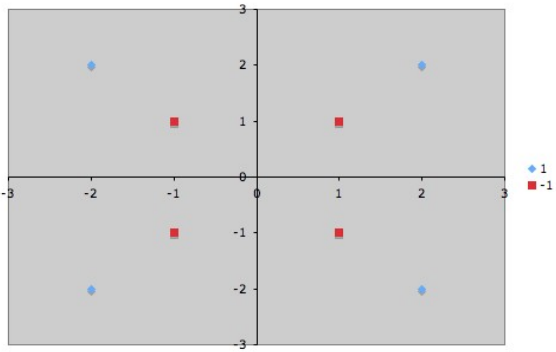

veriler doğrusal olmadığından hiper düzlem tanımlamak için çekirdek tarafından bir fonksiyon ile doğrusal forma taşınması gerekmektedir. Burada kernel trick denilen çekirdek fonksiyonu SVM in en önemli özelliğidir ve veri dağılımına göre belirlenir. İlgili fonksiyon aşağıdadır. Bu fonksiyon RBF, Lineer, non-lineer, Polinom vb. çeşitli fonksiyonlar kullanılabilir. Örnekteki veri türüne göre doğrusal olmayan bir denklem ile veri özellik uzayı doğrusal yapıya getirilir.

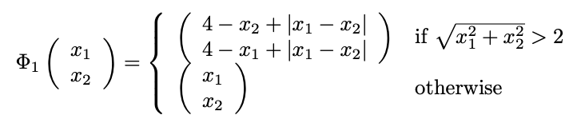

fonksiyondan sonra pozitif ve negatif etiketli veriler sırasıyla aşağıdaki gibi olur:

(2 2), (6 2), (6 6), (2 6)
(1 1), (1 −1), (−1 −1), (−1  1)

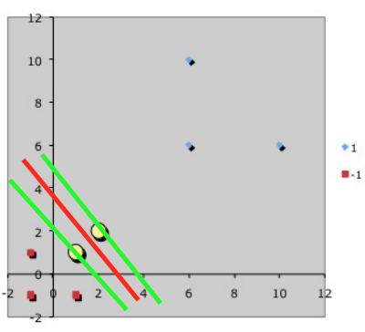

Bu özellik uzayında s˜1 =(1 1) ve s˜2 = (2 2) destek vektörleridir ve aşağıdaki eşitlik kullanılarak hiper düzlem formülüne erişilir.

α1.s˜1 · s˜1 + α2.s˜2 · s˜1 = −1 
α1.s˜1 · s˜2 + α2.s˜2 · s˜2 = +1

3a1 + 5a2  = -1
5a1 + 9a2 = 1
denklemlerinin çözümünde;

a1= -7 
a2= 4  olur.

Bu değerlerden sonra ayırıcı hiper düzlemin genel formülüne gelecek olursak 
y = wx+b denkleminde w katsayı değerinin

denklemi ile 

-7 (1 1 1) + 4 (2 2 1) = (1 1 -3) olduğu görülmektedir.

hiper düzlemin denklemi de 

y = wx + b,    w = (1 1) ve  b = −3 değerleri ile oluşturulmuş olur.

## Kaynaklar:

https://devhunteryz.wordpress.com/2017/09/29/desktek-vektor-makinelerisupport-vector-machines/
http://axon.cs.byu.edu/Dan/678/miscellaneous/SVM.example.pdf
https://medium.com/towards-artificial-intelligence/support-vector-machine-svm-a-visual-simple-explanation-part-1-a7efa96444f2
http://web.mit.edu/6.034/wwwbob/svm-notes-long-08.pdf
