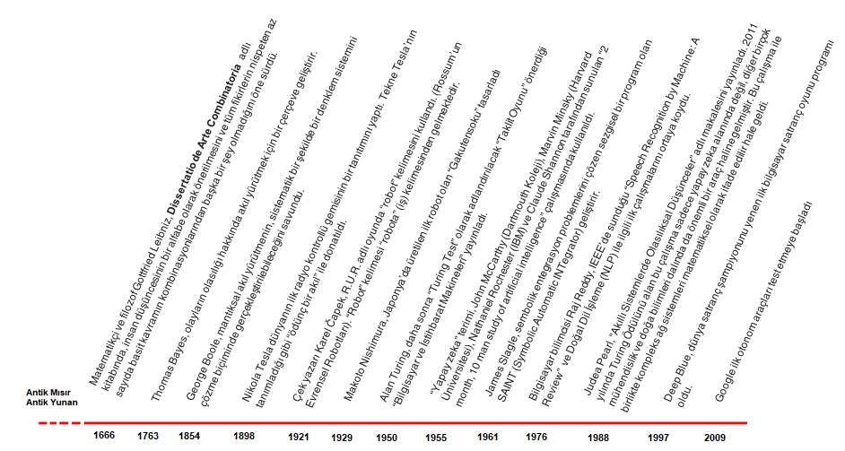

 ** Yapay Zeka ve Makina Öğrenmesi **

Yapay Zaka nedir?   |   Tarihi tarafı  |  Günümüzde geldiği yer |  Makina Öğrenmesi ile bağlantısı

Yapay zeka; insan beyni gibi sayısal mantık yürütebilme, konuşma ve sesleri anlamlandırma, görüntüleri anlamlandırma vb. insanlaın organları ile beyni arasındaki iletişim yeteneğine sahip donanımsal ve yazılımsal sistemlerin toplamıdır.

Yapay zeka tarihi, ilk olarak antik mısır ve antik yunan felsefe ve mitolojisinde görülmekte.
İlk yazılı eser ve bilinen uygulamaları yani bu konudaki milestone ları bir zaman tüneli ile gösterecek olursak:

Ve 2019 yılında birçok model ve teknik ile gelişen yapay zeka artık oyun oynama, bulmaca çözme, satranç vb tek bir konuda eğitildiği zaman en iyi insanı yenmeyi başarmaktadır. İleride çoklu konularda da yapay zekanın insan beynini geçmesi hedeflenmektedir.  

Yapay zeka genel adı altında ele alınan çoklu konular da aşağıdaki başlıklar altında toplanmaktadır.

Makine öğremesi ve yöntemleri nelerdir?

Yapay zekanın bir alt koludur, otomatik olarak öğrenme ve geliştirme ilkesi ile çalışır. Genel çalışma prensibi veride bir kalıp veya bir matematiksel ifadeye göre veriyi genel bir formüle oturtarak çıkarım yapabilmeyi sağlamaktır. Bu kalıp veya matematiksel ifadeler de istatistiksel ve matematiksel yöntemlerin olduğu birçok algoritma ile sağlanmaktadır. Bu algoritmalar tekli veya çoklu kullanılarak model veya modeller oluşur. 
Bu modeller öğrenme ve tahmin yapan makine öğrenmesi modelleridir. Makine öğrenmesini genel olarak 3 tipte incelemek mümkündür.

Bu 3 öğrenme tipinin alt kırılımları ve o kırılımlarda sıklıkla kullanılan modellerin neler olduğunu her bir modelin çalışma mantığını, matematiksel ifadesini ve python üzerinde öğrenme ve tahminleme algoritmalarının nasıl yapıldığına geçelim.
