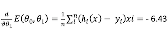
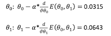
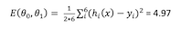
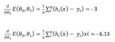

# Supervised Regression Lineer Regression

Basit lineer regresyon, 2 nicel veri arasındaki ilişkiyi gösteren veya tanımlayan istatiksel bir metoddur. 
X ekseninde gösterilen ilk değişken tahmini yapan, bağımsız değişkendir. Y ekseninde gösterilen diğer değişken ise tahmin edilen çıktı yani bağımlı değişkendir.

Basit lineer regresyon ile istatistiksel bir ilişki kurulur, yani tüm bağımlı değişkenlerin tam olarak bağımsız değişkenleri vermesi beklenmez, örn 1kg bağımsız değişkeni 1000 gr bağımlı değişkenine eşit olduğu denklemde (y=x*1000) sonuç hep tam olarak istenilen bağımlı değişkeni verir bu deterministik bir ilişkidir (PV=nRT, km=1000*m, V=I * R formülleri de deterministik ilişki örneğidir.)  

Deterministik yani fonksiyonel ilişkilerde denklem veriler arası ilişkiyi tam olarak kurmakta fakat biz bu ilişkinin tam kurulmadığı istatistiksel bir ilişki ile ilgileniyoruz. Örn. Boy-kilo, Boy - ayakkabı numarası, hız - yakıt tüketimi, Tecrübe-maaş gibi örneklerde ilişki tam değildir ama yüksek oranda bir ilişki mevcuttur.  

Burada verilere en iyi uyan eğriyi bulabilmek için gözlemlenen her bir veri noktası için gözlem hatasının en küçük olan doğru tespit edilmelidir. Bunun için   

- Sıradan En Küçük Kareler  
- Theil-SenRegressor: Genelleştirilmiş Medyan Tabanlı Tahminci 

yöntemleri en çok kullanılan yöntemlerdendir. 

Bu yöntemlerden biri ile eğri formülü hesaplanarak yeni gelecek değerler için bu denklem kullanılmaktadır. 

## Matematiksel İfade

Biz en küçük kareler metodunu kullanarak eğriyi tanımlayacağız. Bu yöntemde çıktı ile hedef değeri arasındaki karesel farkların toplamı bize hata veya maliyet (cost) fonksiyonu verir. Bu maliyet kare hata (Square Error) formülü ile hesaplanmaktadır.

Burada hata fonksiyonunun minimum olmasını istediğimizden denklemin lokal minimum değerine doğru iteratif bir şekilde yakınsanmalı. Bir fonksiyonun lokal minimumunu gitmek için gradient descent (azalma) algoritması kullanılır. Bu algoritma denklemin lokal minimuna yakınsamak için birinci türev kullanır.  

Gradient descent algoritmasında yakınsama yönü gradient doğrultusuna ters yöndeki bir doğrultu üzerinde hareket edilir. O yönde minimum nokta ile belli bir adım miktarı veya öğrenme katsayısı (learning rate) ile çarpılarak bir sonraki yeni ağırlık bulunur. 

y = x1w1+x2w2+x3w3+...+b 

Toplam hata oranı minimum bir orana geldi ise eğitime son verilir. Ya da belli bir iterasyon sayısına ulaşıldığında yine eğitime son verilebilir.
Bu şekilde istenilen w1,w2. .. değerleri bulunur ve  

y = w1x +b denklemi oluşturulur. 

## Basit Örnek 

İş Tecrübesine göre maaş tahmini yapalım elimizde aşağıdaki iş tecrübeleri ve aldığı maaşlar (Bin) olsun. Bu eğitim verisi ile 1.8 yıllık bir çalışanın maaşını tahminleyelim.  

|Tecrübe|Maaş (Bin)|
|---|-----|
|1.1|2|
|1.3| 2.2|
|1.5| 2.3|
|2| 4|
|2.2|3.9|
|3|4.5|

Yukarıdaki grafikte verilerin dağılımını görüntülüyoruz bu dağılamı en iyi temsil edecek, en iyi uyacak doğruyu bulacağız.  

ilk olarak;  

denklemimizi *1. iterasyon* için kuruyoruz.  
 
ilk iterasyonda  ağırlıklar Ɵ0 ve Ɵ1  değerleri 0, öğrenme katsayısı (learning rate (α))= 0.01 olarak alınır. 

h(x) = Ɵ0 + Ɵix   

h1(x1) = Ɵ0 + Ɵix1 =0 
h2(x2) = Ɵ0 + Ɵix2 =0 
h3(x3) = Ɵ0 + Ɵix3 =0 
h4(x4) = Ɵ0 + Ɵix4 =0 
h5(x5) = Ɵ0 + Ɵix5 =0 
h6(x6) = Ɵ0 + Ɵix6 =0 

Hesaplanan yeni Y değerlerinden gerçek Y dizindeki her noktanın farkı alınır. Sonra farkın karesi alınır ve alınan bu farkların karesi her nokta için toplanarak maliyet fonksiyonu hesaplanır. Bu değer toplam hatayı verir. 

 

5.47 hata değerinin detaylı olarak hesaplanması aşağıda gösterilmektedir.  

| |Y Değeri|Yeni Y Değeri|(Y-Y')^2|
|--|-------|-------------|--------|
|Ɵ0=0|2,00|0,00|4,00|
|Ɵ1=0|2,20|0,00|4,84|
| |2,30|0,00|5,29|
| |4,00|0,00|16,00|
| |3,90|0,00|15,21|
| |4,50|0,00|20,25|
|E(Ɵ0,Ɵ1)=|(4+4,84+5,29+16+15,21+20,25) /12 =|5,47|

5.47 değerini minimum yapacak X değerini arıyoruz.  X değişkeni Θ0 ve Θ1 bağlı olduğu için Θ0 ve Θ1'e göre ayrı ayrı fonksiyonun türevleri alınır.

Θ0' a göre türev:

 

-3.15  türev değerinin detaylı olarak hesaplanması aşağıda gösterilmektedir.

|Y Değeri|Yeni Y Değeri|(Y-Y')|
|--------|-------------|------|
|2,00|0,00|-2,00|
|2,20|0,00|-2,20|
|2,30|0,00|-2,30|
|4,00|0,00|-4,00|
|3,90|0,00|-3,90|
|4,50|0,00|-4,50|
|(-2+-2,2+-2,3+-4+-3,9+-4,5)/6 =|-3,15|

Θ1' e göre türev:

 

-6.43  türev değerinin detaylı olarak hesaplanması aşağıda gösterilmektedir.

|Y Değeri|Yeni Y Değeri|Xi|(Y-Y') * Xi|
|--------|-------------|----|-------|
|2,00|0,00|1,10|-2,20|
|2,20|0,00|1,30|-2,86|
|2,30|0,00|1,50|-3,45|
|4,00|0,00|2,00|-8,00|
|3,90|0,00|2,20|-8,58|
|4,50|0,00|3,00|-13,50|
|(-2,2+-2,86+-3,45+-8+-8,58+-13,5) / 6 =|-6,43|

Gradient descent algoritmasında yakınsama yönü türevin ters yöndeki bir doğrultu üzerinde hareket edilir. O yönde minimum nokta öğrenme katsayısı (learning rate) (0.01) ile çarpılarak bir sonraki yeni ağırlıklar bulunur. ve hata maliyet fonksiyonu da aşağıdaki gibi bulunur.

 

h(x) = 0.0315 + 0.0643x  

Denklemimizi 2. iterasyon için kuruyoruz.  

Hesaplanan ağırlıklar ile beraber doğrunun denklemi kullanılarak her X noktası için yeni Y değerleri hesaplanır. 

h(x) = 0.0315 + 0.0643x 

h1(x1) = Ɵ0 + Ɵix1 = 0.0315 + 0.0643 * 1,1 = 0,10223 
h2(x2) = Ɵ0 + Ɵix2 = 0.0315 + 0.0643 * 1,3 = 0,11509 
h3(x3) = Ɵ0 + Ɵix3 =0.0315 + 0.0643 * 1,5 = 0,12795 
h4(x4) = Ɵ0 + Ɵix4 =0.0315 + 0.0643 * 2 = 0,1601 
h5(x5) = Ɵ0 + Ɵix5 =0.0315 + 0.0643 * 2,2 = 0,17296 
h6(x6) = Ɵ0 + Ɵix6 =0.0315 + 0.0643 * 3 = 0,2244 

 

| |Y Değeri|Yeni Y Değeri|(Y-Y')^2|
|---|------|-------------|--------|
|Ɵ0=0.0315|2,00|0,10|3,60|
|Ɵ1=0.0643|2,20|0,12|4,35|
| |2,30|0,13|4,72|
| |4,00|0,16|14,74|
| |3,90|0,17|13,89|
| |4,50|0,22|18,28|
|E(Ɵ0,Ɵ1)=|(3,6015309729+4,3468497081+4,7178012025+14,74483201+13,8908271616+18,28075536)/12 =|4.97

Toplam hata 4.97 sıfırdan veya belli bir epsilon değerinden  büyük olduğu için  Θ0 ve Θ1'e göre türevler yeniden alınarak  ağırlıklar tekrar hesaplanır.  

Θ0' ve Θ1'e göre türev:  

 

ve yeni ağırlıkların hesaplanır. 

 

h(x) = 0.03 + 0.0613x 

Denklemimizi bu şekilde  E(Ɵ0 , Ɵ1)  değeri O'a yakınsayana kadar bu şekilde itersayon devam eder.  
0 'a yakınsadığı zamanki katsayılar basit lineer denklemin katsayıları olacaktır. Denklem iterasyonlar sonrasında 

y = 0.4183299389002024 + 1.47657841 x 

halini alır. Biz 1.8 yıl çalışan birinin maaşını tahminlersek denklemde x değerine 1.8 değerini verdiğimizde 

y = 3.07617108. sonucunu buluruz. 

## Kaynaklar
https://medium.com/@billmuhh/lineer-regresyonun-matemati%C4%9Fi-e992564555cb
https://scikit-learn.org/stable/modules/linear_model.html#theil-sen-estimator-generalized-median-based-estimator

