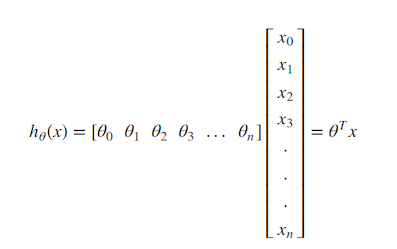
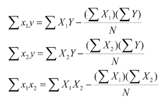
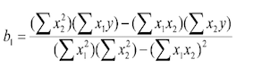
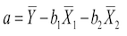

# Supervised Regression Multi Lineer Regression

Lineer Regresyon ile aynıdır aslında tek farkı lineer regresyonda tek bir bağımsız değişken bir bağımlı değişkeni tahmin eder (y=ax+b), çoklu lineer regresyonda çoklu bağımsız değişken bir bağımlı değişkeni tahmin eder (y = a1x1 + a2x2 + a3x3 + anxn  + b) 

## Matematiksel İfade

Öncelikle değişkenlerin matris çarpımı olarak formülü  

  

Burada matris sonucu aslında yukarıda bahsedilen y=b1 * x1+b2 * x2... bn * xn+ a formülüne dayanır sadece gösterim olarak farklılıkları mevcuttur. Burada:     
y , h0(x) = Bağımlı değişken veya tahmin edilen değişken   
Ɵ, b = bağımsız değişkenler veya eğim değeri de denilebilir (birden çok olabilmektedir.)   
a =  sabit değer, tüm bağımsızlar 0 olduğunda bağımlı değişkene eşit olan değer.   

Ɵ0, Ɵ1 ... vb katsayıları hesaplamak için  

   

y= b1x1+b2x2+a denklemindeki gibi iki bağımsız değişkenin hesabı için:   
    

## Basit Örnek

Örnek veri setimiz aşağıdaki gibi Y, X1 ve X2 den oluşan bir veri seti olsun biz bunun yanına 3 kolon daha açıp daha sonra bağımsız değişken hesabı için kullanacağımız bazı hesapları da yazalım:   

Burada Y = iş performans notu, X1 ve X2 de yapılan test sonuçları olarak düşünülebilir.  
Aşağıdaki veriler göz önüne alınarak multi lineer regresyon ile X1 testinden 50 X2 testinden de 30 alan bir çalışanın performans notunun ne olacağını tahminleyelim ve formülünü oluşturalım.    

| Y | X1 | X2 | X1 * Y | X2 * Y | X1 * X2 |
|---|----|----|------|------|-------|
| 1 | 40 | 25 | 40   | 25   | 1000  |
| 2 | 45 | 20 | 90   | 40   | 900   |
| 1 | 38 | 30 | 38   | 30   | 1140  |
| 3 | 50 | 30 | 150  | 90   | 1500  |
| 2 | 48 | 28 | 96   | 56   | 1344  |
| 3 | 55 | 30 | 165  | 90   | 1650  |
| 3 | 53 | 34 | 159  | 102  | 1802  |
| 4 | 55 | 36 | 220  | 144  | 1980  |
| 4 | 58 | 32 | 232  | 128  | 1856  |
| 3 | 40 | 34 | 120  | 102  | 1360  |
| 5 | 55 | 38 | 275  | 190  | 2090  |
| 3 | 48 | 28 | 144  | 84   | 1344  |
| 3 | 45 | 30 | 135  | 90   | 1350  |
| 2 | 55 | 36 | 110  | 72   | 1980  |
| 4 | 60 | 34 | 240  | 136  | 2040  |
| 5 | 60 | 38 | 300  | 190  | 2280  |
| 5 | 60 | 42 | 300  | 210  | 2520  |
| 5 | 65 | 38 | 325  | 190  | 2470  |

Verilerin genel istatistiklerini kendi içlerinde hesaplayarak X1 ve X2 nin bağımsız değişkenlerini hesaplamak için gerekli değerler hesaplanır.    

| Y     | X1     | X2     | X1 * Y   | X2 * Y   | X1 * X2  |     |
|-------|--------|--------|--------|--------|--------|-----|
| 65    | 1038   | 655    | 3513   | 2219   | 34510  | Toplam |
| 20    | 20     | 20     | 20     | 20     | 20     | Adet   |
| 3.25  | 51.9   | 32.75  | 175.65 | 110.95 | 1725.5 | Ort.   |
| 1.25  | 7.58   | 5.24   | 84.33  | 54.73  | 474.60 | Stand. Sap.  |
| 29.75 | 1091.8 | 521.75 |        |        |        | USS |

Aşağıdaki formülleri ile ortalamadan uzaklıklar X1 ve X2 için aşağıdaki şekilde hesaplanır burada X3, X4 ... Xn tane örnek olsaydı bunlarında birbirleri ile olan uzaklıklarını hesaplayarak aşağıdaki formülleri her gelen bağımsız hesaplayacaktık.    

    

Bu formüller ve daha önce hesapladığımız değerler kullanılarak aşağıdaki martis x1 ve x2 için oluşturulur.   

 
   

Şimdi artık ilk bağımsız değişkeni bulacağımız formülü uygulayabiliriz.

   

b1 = (521.75)(139.5) - (515.5)(90.25) / (1091.8)(521.75) -(515.5)(515.5)
b1=26260.25/303906.4 = 0.086409

   

b2 = (1091.8)(90.25)-(515.5)(139.5) / (1091.8)(521.75)-(515.5)(515.5) 
b2=26622.7 / 303906.4 = 0.087602

denklem sabiti de aşağıdaki formül ile hesaplanır:

   

a = 3.25 - 0.086409(51.9) - 0.087602(32.75) = -4.1

ve genel formül de aşağıdaki gibi oluşturulur:
y = 0.086409*X1 + 0.087602*X2 - 4.1    

Şimdi bu formüle test sonuçlarını yazarsak:    

y = 0.086409*50 + 0.087602*30 - 4.1    
y = 2.8450 olarak çıkmaktadır.   

## Kaynaklar

http://www.stat.yale.edu/Courses/1997-98/101/linmult.htm#:~:text=Multiple%20linear%20regression%20attempts%20to,linear%20equation%20to%20observed%20data.&text=In%20words%2C%20the%20model%20is,2x2%20%2B%20...

http://faculty.cas.usf.edu/mbrannick/regression/Part3/Reg2.html

