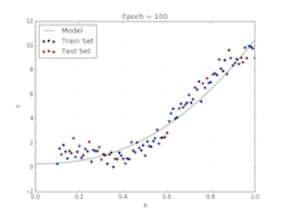
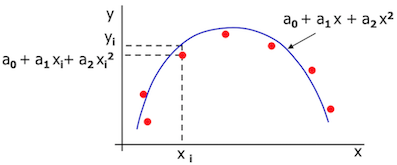
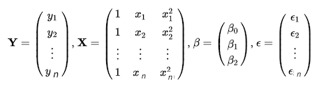
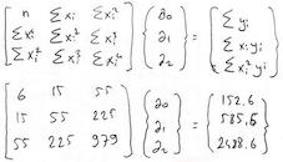

# Supervised Regression Polynominal Regression

Lineer regresyon da verilerin dağılımının doğrusallık gösterdiği durumlarda kullanıldığını ve aslında öncelikle veri dağılımının incelenerek model seçimi yapılabileceğini belirtmiştik, tabi bu durum çok bağımsız değişkenimiz olduğunda dağılıma bakmak yerine farklı metodlar ile veriyi test etmek gerekeceğinden kullanılmayacaktır. Ama yine de veriyi 2 boyuta düşürerek dağılımlar kontrol edilebilir.   
Verilerin dağılımı lineer olmayan bir şekil oluşturuyorsa bu durumda polinominal regresyon modelinin işe yarayabileceği düşünülmektedir. En küçük kareler yöntemi ile bu ilişki için en uygun parabol oluşturulabilmektedir.  Bu ilişkiyi kurmak için. aşağıdaki genel formul kullanılmaktadır.   
Y=β0+β1X+β2X2+…+βh Xh+ϵ,   
Burada h dediğimiz üssü değer fonksiyonun derecesidir eğer fonksiyon;   
2 dereceli olursa (h=2) *quadratic*, 3 dereceli olursa (h=3) *qubic*, 4 dereceli olursa (h=4) *quartic* adını almaktadır.   
Burada X ve Y arasından doğrusal olmayan bir ilişki olmasına rağmen β0,β1,β2.. arasından doğrusal bir ilişki mevcuttur.    
Verilere bakarak bu ilişkiyi kurmak için bizim sadece X ve Y değerlerine ihtiyacımız vardır.    

   

Polinominal Regresyon Model ile İlgili Bilinmesi Gereken Bilgiler:   

- Model yüksek n örneklemi ile oluşturulduğunda daha güvenilirdir.  
- Gözlenen değerlerinizin sınırlarını aşmayın, özellikle polinom fonksiyonunda belirgin bir eğri varsa, bir ekstrapolasyon modelin kapsamı dışında anlamsız sonuçlar üretir.  
- Daha yüksek dereceli fonksiyonlarda, tahminlerin büyüklüğünün ne kadar büyük olacağını düşünün.  
- Yüksek dereceli bir fonksiyonu dahil etmek için düşük p değerleriyle kesinlikle gitmeyin, bunları sadece sonuçta ortaya çıkan göstergeler makul görünüyorsa modelinizi desteklemek için kullanın. Bu, "pratik önemi" veya "istatistiksel önemi" belirlemeniz gereken bir durum örneğidir.  
- Regresyon modellerinde genel düşünceye bakarak hiyerarşi prensibi ile modelimiz hiyerarşik olarak  oluşturulmalıdır. Yani, eğer modelimiz tahmin değeri ile istatistiksel olarak anlamlı Xh    değerini içeriyorsa modelin j>h değerlerini de içermesi gerekmektedir. yani qubic dereceli bir fonksiyonda β1X+β2X2 değerlerinin de olması gerekmektedir.   

*Polinom Regresyonu kullanmanın avantajları:*   
1. Polinom bağımlı ve bağımsız değişken arasındaki ilişkiye en iyi yaklaşımı sağlar.  
2. Geniş bir fonksiyon aralığı altına sığabilir.  
3. Polinom temel olarak geniş bir eğrilik yelpazesine uyar.  

*Polinom Regresyonunu kullanmanın dezavantajları*  
1. Verilerde bir veya iki aykırı değer bulunması, doğrusal olmayan analizin sonuçlarını ciddi şekilde etkileyebilir.  
2. Bunlar aykırı değerlere karşı çok hassastır.  
3. Maalesef doğrusal olmayan regresyonda aykırı değerlerin tespiti için doğrusal regresyondan daha az model doğrulama aracı bulunmaktadır.  

## Matematiksel İfade

Genel olarak polinominal fonksiyon formülü aşağıdadır.  
Y=β0+β1X+β2X2+…+βh Xh+ϵ,   

yukarıdaki genel formül  ile oluşturulacak quadratic eğri fonksiyon formülü aşağıdaki gibi olacaktır.  

  

Y=β0+β1X+β2X2   

n adet örneklem için bu fonksiyon aşağıdaki matris ile gösterilebilir.  

  

## Basit Örnek

| x | y    |
|---|------|
| 0 | 2,1  |
| 1 | 7,7  |
| 2 | 13,6 |
| 3 | 27,2 |
| 4 | 40,9 |
| 5 | 61,1 |

veri setimiz olsun  bu veri setinin en küçük kareler yöntemine en uygun olan parabol eğrisini ve  fonksiyonunu oluşturalım ve x=6 değerini tahminleyelim.

y= a1X+ a2X2  + a0

En küçük karaler parabolü normal eşitliği (Bu eşitliği çoklu lineer regresyon'da da kullanmıştık.) kullanarak a0,a1 ve a2 değerlerini hesaplayalım :

    

matris çarpımı ile 

6 * a0 + 15 * a1 +55 * a2 = 152.6
15 * a0 + 55 * a1 +225 * a2 = 585.6
55 * a0 + 225 * a1 +979 * a2 = 2488.6 

denklemleri elde edilir 3 bilinmeyenli 3 denklem taraf tarafa toplama yöntemi ile çözüldüğünde 
*a0 = 2.479, a1= 2.359, a2= 1.861*
değerleri bulunur. Quadratic polinominal formülde aşağıdaki gibi olur:

*Y = 2.359 x + 1.861x2 + 2.479*

*X=6 değeri içinde  Y = 83.629değeri elde edilir.*

## Kaynaklar

https://towardsdatascience.com/introduction-to-linear-regression-and-polynomial-regression-f8adc96f31cb
https://online.stat.psu.edu/stat462/node/158/
http://users.metu.edu.tr/csert/me310/me310_5_regression.pdf

