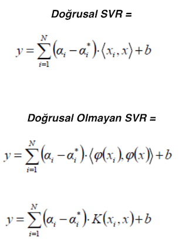
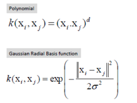

# Supervised Regression Support Vector Machine Regression

Supervised Classification - Support Vector Machine  bölümünde verilen tarihse ve teorik bilgiler aynı şekilde Support Vector Regression içinde geçerlidir. Bu modelde sınıflandırma yerine tahminleme yapılabilmektedir. Metod olarak aynı destek vektör makineleri temelini kullanmaktadır.

SVR, modelimizde ne kadar hatanın kabul edilebilir olduğunu tanımlama esnekliği sağlar ve verilere uyacak uygun bir çizgi (veya daha yüksek boyutlarda düzlem) sağlamaktadır. Ordinary Least Square yöntemi ile yapılan doğrusal regresyonların aksine SVR'ın işlevi  karesel ortalamayı küçültmek değil, katsayıları (katsayı vektörünün l2 normunu) küçültmektir. 
Hata terimi bunun yerine, mutlak hatayı maksimum hata ϵ (epsilon) ile belirtilen bir kenar boşluğundan daha az veya ona eşit olarak ayarladığımız kısıtlamalarda işlenir. 
Modelimizin istenen doğruluğunu elde etmek için epsilonu ayarlayabiliriz. 
Yani nesnel işlevimiz ve kısıtlarımız aşağıdaki gibidir:

İndirgeme (minimize): Min(1/2 ||w||2)    
Kısıtlama (constrains): | yi  - wixi | >= €    

Grafik:  

Yukarıdaki grafikte siyah renkli doğrular hata marjinlerini ifade etmekte ve kırmızı renkli doğru da marjinlere göre veriye en iyi uyum sağlayan doğruyu göstermektedir. Bu veride hiç gürültü olmadığını görüyoruz ama gerçek hayatta veriler bu kadar uyumlu dağılım göstermeyebilir ve hata marjinleri dışında da veriler görünebilir. Bu nedenle, ϵ'dan büyük hata olasılığını hesaba katmamız gerekir. Bunu Slack değişkenlerle yapabiliriz.

Slack değişken kavramı basittir: ϵ dışında kalan herhangi bir değer için, marjdan sapma hesaplanır ve  ξ olarak gösterilir.
Bu sapmaların var olma potansiyeline sahip olduğunu biliyoruz, ancak yine de mümkün olduğunca en aza indirmek istiyoruz. Böylece, bu sapmaları  fonksiyona ekleyebiliriz.

İndirgeme (minimize):  

Kısıtlama (constrains): | yi  - wixi | >= € + |ξ i|  
Grafik:  

Bitmedi son bir  hiper parametremiz  (C) daha var. C arttıkça ϵ dışındaki noktalara toleransımız da artar.
C 0'a yaklaştıkça tolerans'da 0 a yaklaşır ve denklemimiz de basitleştirilmiş olur.
SVR'ın yaptığı iş aslında en uygun C ve epsilon (ϵ) değerlerini bulmak ve bulduğu değerler ile fonksiyonu kurmaktır.

## Matematiksel İfade

Doğrusal olmayan SVR formülünde K(xi,xi) fonksiyonu kernel fonksiyonudur ve verinin dağılımına göre bu fonksiyonu seçebiliriz.
Model performansı için büyük önem taşır doğrusal dışında en çok kullanılan çekirdek fonksiyonları aşağıdadır:

## Basit Örnek

Örnek olarak  
x ve y değerlerimiz olsun:   (3 1), (3 −1), (6 1) , (6 −1),  (1 0),  (0 1), (0 −1) , (−1 0) olsun.   
bu veriler ile lineer bir svr fonksiyonu oluşturalım.  

Destek vektörleri iki farklı sınıfta birbirine en yakın olan noktalar olacaktır.   Bunlar s1=(1 0), s2=(3 1), s3=(3 -1)  
Destek vektörleri 1 bias girdisi ile arttırılmış olarak vektörize edeceğiz.  

 s1 = (1,0)  ise s˜1 = (1,0,1);    s˜2= (3,1,1);     s˜3= (3,-1,1)  
     
α1Φ(s1) · Φ(s1) + α2Φ(s2) · Φ(s1) + α3Φ(s3) · Φ(s1) = −1   
α1Φ(s1) · Φ(s2) + α2Φ(s2) · Φ(s2) + α3Φ(s3) · Φ(s2) = +1   
α1Φ(s1) · Φ(s3) + α2Φ(s2) · Φ(s3) + α3Φ(s3) · Φ(s3) = +1    
    
α1s˜1 · s˜1 + α2s˜2 · s˜1 + α3s˜3 · s˜1 = −1   
α1s˜1 · s˜2 + α2s˜2 · s˜2 + α3s˜3 · s˜2 = +1   
α1s˜1 · s˜3 + α2s˜2 · s˜3 + α3s˜3 · s˜3 = +1    
     
2α1 + 4α2 + 4α3 = −1    
4α1 + 11α2 + 9α3 = +1    
4α1 + 9α2 + 11α3 = +1    
     
burada yukarıdaki denklemleri taraf tarafa topladığımızda: a1= -3.5,  a2= 0.75,  a3 = 0.75 olarak hesaplanır.   

Şimdi bu ai değerlerin ayırıcı hiperdüzlemi nasıl etkilediğine bakalım.   

  

daha önceden bias eklediğimiz vektörü çıkararak w ve offset b değerlerine ayırırsak hiper düzlem formülümüz   
y = wx+b  w = (1 0)  ve b = −2  olur.   

Burada y bağımlı değişkeni tüm bağımsız değişkenler için 2 değerini alacaktır.     

   

## Kaynaklar
https://towardsdatascience.com/an-introduction-to-support-vector-regression-svr-a3ebc1672c2
https://www.saedsayad.com/support_vector_machine_reg.htm
http://web.mit.edu/6.034/wwwbob/svm-notes-long-08.pdf
http://www.robots.ox.ac.uk/~az/lectures/ml/lect3.pdf

